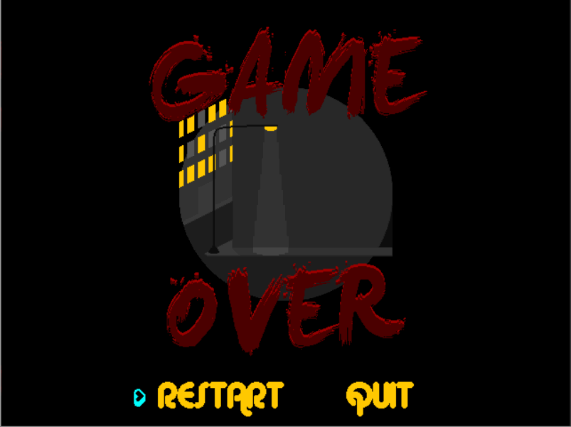

# K3YB04RD K!D

This is a shell for an SDL2 game. This demo contains a starting screen and a game over screen and as well the starting screen also doubles as a drum machine to play along with the background music. This is heavily based on Lazy Foo's SDL2 tutorials but was desigined to incorporate and set up all the aspects to make a game(images and fonts rendering, sound playing, spritesheet animation, controls, basic game structure) without necessarily making a game.

## Controls
:one: Snare\s\s
:two: High tom\s\s
:three: Middle tom\s\s
:four: Low tom\s\s
:five: Clap\s\s
:six: Bell\s\s
:seven: Rising sweep\s\s
:eight: Falling sweep\s\s
:nine: Pause the music\s\s
:zero: Stop the music\s\s

## Starting screen

## Ending screen

All graphics were made by Eric Bitkofer